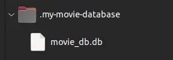
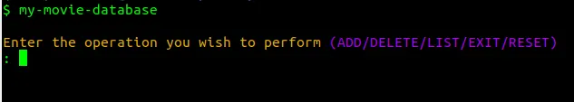
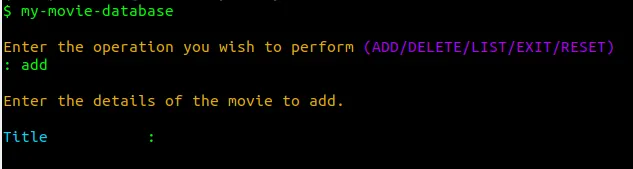
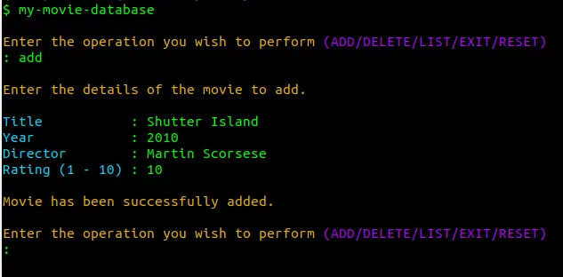
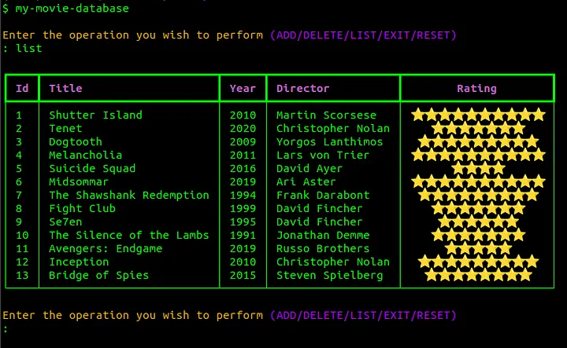
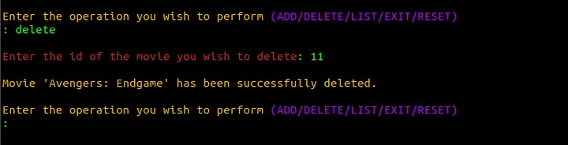
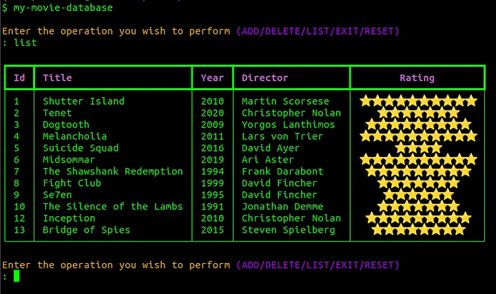
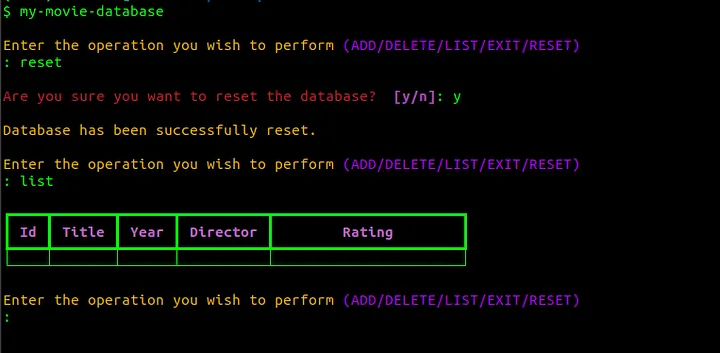
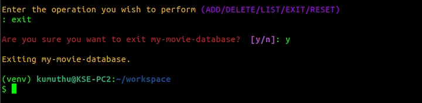

# Usage

## Running

To run, simply type my-movie-database in your terminal.

```bash
my-movie-database
```

When you first run it, the app will create the database in the current user’s home
folder. It will be in a hidden folder in your home directory named <code>.my-movie-database</code>.



## Operations

When the application is run it will prompt you for the operation you wish to
execute.



There are 5 operations that are available:

- <code>ADD</code> - Adding movies to the database.
- <code>DELETE</code> - Delete a particular movie from the database.
- <code>LIST</code> - List all the movies in the database.
- <code>EXIT</code> - Exit the application.
- <code>RESET</code> - Delete all the movies from the database.

## Adding Movies

To add movies, simply type ‘add’ or ‘ADD’ at the above prompt and hit enter.



Now, the application will ask for movie details. After entering all the details and your personal rating, the application will confirm that the movie has been added.



Above, I have added one of my favourite movies. After any operation it will prompt you for another operation until you select the exit option and exit the program.

## Listing Movies

After adding several movies, I will list all the movies by using the list option. For that, type ‘list’ or ‘LIST’
when prompted and hit enter.



This produces a table with all the movies in the database. The rating will be given as stars. For example, if a movie has a rating of 7, 7 stars will be displayed in the ‘Rating’ column. The Id of a movie is assigned by my-movie-database and is unique.

## Deleting Movies

To delete a movie, select the DELETE option. For this, similar to the other operations type ‘delete’ or ‘DELETE’ when prompted.



It prompts you to enter the Id of the movie to be deleted. This should be obtained from the table from the list operation.

Now, let’s confirm that the movie that was deleted was indeed deleted.



As you can see, the movie has been deleted.

## Resetting the Database

If you want to reset the database and start again, use the reset option. You can type ‘reset’ or ‘RESET’ for this.



## Exiting the Application

To exit the application use the exit option. You can type ‘exit’ or ‘EXIT’ for this.



Note that the information in the database persists even after the program has been exited. Indeed, even if you were to uninstall and reinstall the application the database will still persist as long as you do not delete the database file mentioned previously.
